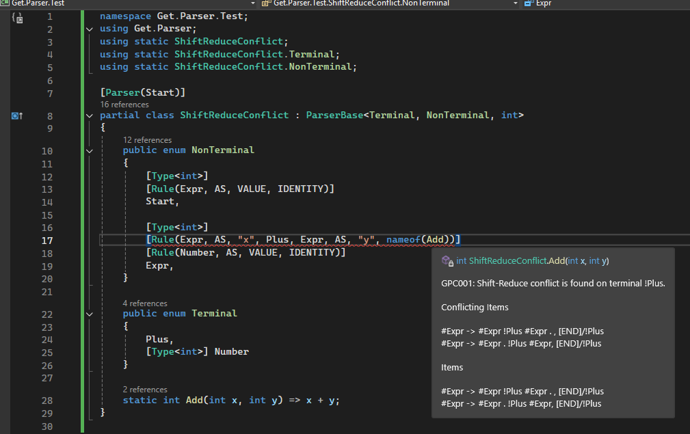
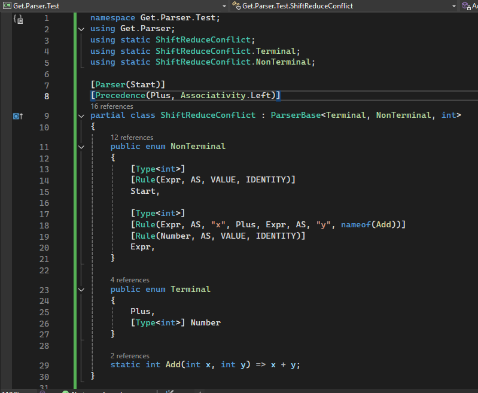

# Get’s Parser and Lexer (BETA)

A general-purpose **lexer** and **LR(1) parser** framework for C#, designed with **analyzers** to catch conflicts and bugs **as you type** — no custom extensions required.

## ⚠️ Disclaimer

This project is currently in **BETA**. Bugs may exist. Please report issues via the Issues tab.

## ✨ Key Features

* **Real-time conflict detection**: Lexer ambiguities, shift/reduce, and reduce/reduce parser conflicts are reported as diagnostics — no need to run your program to catch critical grammar errors.
* **Seamless IDE support**: Designed to work with any C# IDE that supports Roslyn analyzers and source generators — such as Visual Studio. No extensions required.
* **Two authoring modes**:
  * **Attribute-based (recommended)**: Full IntelliSense + diagnostics support via source generators.
  * **Manual in-code**: Build lexers/parsers programmatically (no attributes or generators), useful for advanced scenarios or experimentation — but **no analyzer support**.
* **Custom semantic actions**: Embed custom C# logic for token values and grammar rules.
* **Fully integrated into C# projects**: Define your entire grammar directly in C# — no external DSLs or tooling needed.

## 🧱 Lexer

The lexer takes an input stream of characters and emits `IEnumerable<IToken>`, optionally carrying values via user-defined callbacks. It supports:

* **Lexer state machines** via `GoTo(state)` and `Reverse(characters)`
* **Custom token processing** using semantic actions

### ✅ Usage Options

* **Recommended**: Use the source generator with C# attributes (example: `CustomLexerSourceGen.cs`) for IntelliSense and diagnostics.
* **Advanced/manual**: Build lexer rules directly in code (example: `CustomLexer.cs`). This provides flexibility but **does not support analyzers**.

## 📚 LR(1) Parser

The parser processes context-free grammar definitions, resolving them using **LR(1)** parsing logic. It supports:

* **User-defined semantic actions** embedded in C#
* **Precedence declarations** for disambiguating operator-like rules
* **Real-time validation** when using the attribute-based approach

### ✅ Usage Options

* **Recommended**: Use the source generator with annotated methods (example: `TestSourceGenMath.cs`) for full IDE support.
* **Advanced/manual**: Define grammar rules directly in code (example: `TestRegex.DFA.cs`, `TestManualRuleAttr.DFA.cs`). This mode skips analyzers.

## 🔍 Analyzers

The framework detects lexer and parser conflicts **as you type**, directly inside supported C# IDEs.

> ⚡ This provides immediate feedback while authoring your grammar — no need to compile or run the program.

### What Analyzers Catch

- 🧱 **Lexer conflicts** — e.g., ambiguous or overlapping token patterns
- 🔄 **Shift/reduce and reduce/reduce parser conflicts**
- 🧠 **Inline diagnostics** — shown in-editor via IntelliSense squiggles and tooltips

> 📌 Analyzer support is **only available in the attribute-based (source generator) mode**.  
> Manual in-code grammar does **not** currently support analyzers.

---

### 📸 Analyzer in Action

  

**Above**: Without precedence, the parser encounters a shift-reduce conflict.

  

**Resolved**: Adding precedence resolves the ambiguity at compile time.

---

### Language authoring (detailed)

For a step-by-step guide with examples (lexer states, parser rules, wiring tokens to `Parse`, and in-repo references), see [Language-Authoring-Guide.md](Language-Authoring-Guide.md).